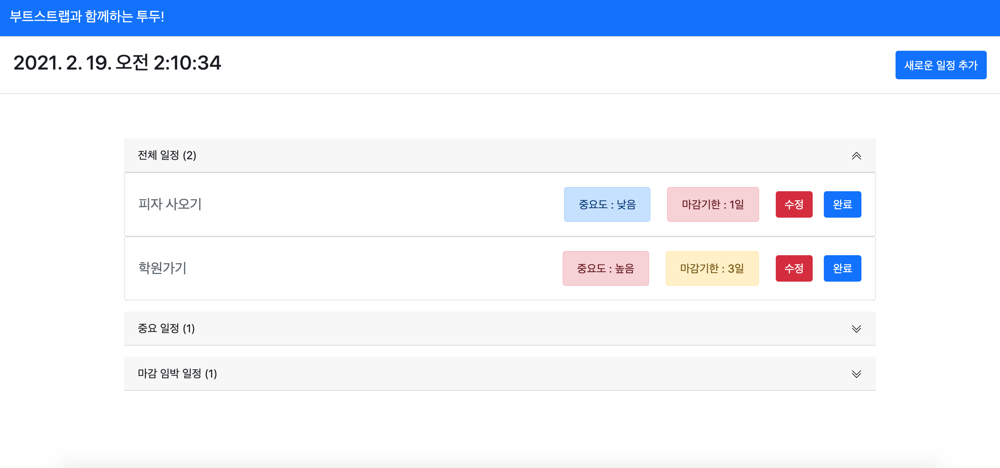
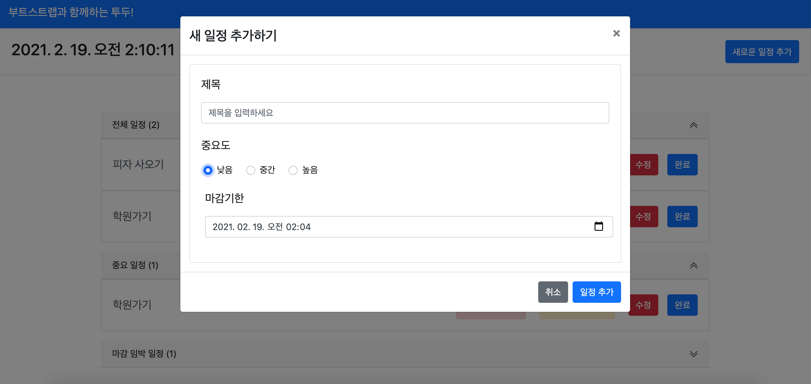

## 즐거운 부트스트랩 연습!

### 2021. 02. 19

## [메인 화면]

## [모달]

부트스트랩을 새로 배우면서 만들고 있는 투두앱입니다! (투두앱 수집가가 되었네요)

목업 백엔드는 `json-server` 라이브러리를 활용하며 상태관리는 `react-redux`를 활용합니다.

처음에는 부트스트랩만 맛보려 시작한 프로젝트인데, 어쩌다 보니 뭔가 주렁주렁 붙고 있네요.

아직 작업이 끝나지 않았으니, 끝까지 기대해주세요! (모달과 아코디언 컴포넌트는 진짜 신세계!!)
